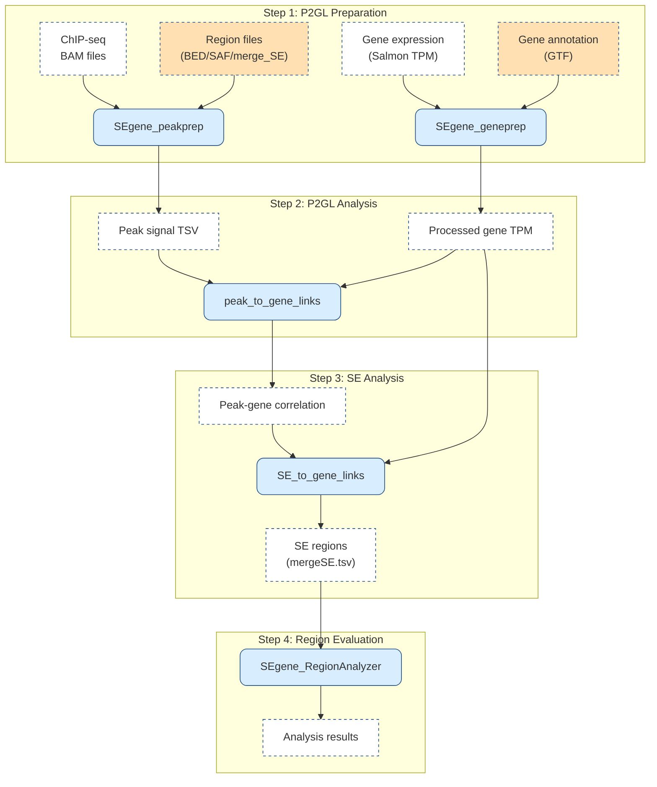

# SEgene

*(For the Japanese version of this README, please see [README_ja.md](https://github.com/hamamoto-lab/SEgene/blob/main/README_ja.md).)*

**SEgene**  (pronounced "S-E-gene") is a platform designed to identify and analyze Super-Enhancer-to-gene links (SE-to-gene links) by incorporating the peak-to-gene links approach, a statistical method that uncovers correlations between genes and peak regions.
This repository contains tools and scripts for **SEgene**.

## Features

- Analyze the relationship between super-enhancers and genes
- Visualize data using graph theory
- Interactive analysis with Jupyter Notebook

## Program Structure

SEgene currently consists of four primary components (P2GL data preparation, P2GL correlation analysis, Super-enhancer analysis, and Region evaluation analysis). **Additionally, development versions of programs are available and are continuously being developed and enhanced. See the [Development Versions](#development-versions) section for more information.**

### Workflow Overview

The following diagram illustrates the complete workflow of SEgene:

### P2GL Data Preparation

- [**SEgene_peakprep**](https://github.com/hamamoto-lab/SEgene/tree/main/SEgene_peakprep)  
  Quantifies and normalizes signal values from ChIP‑seq data (BAM files) for specified genomic regions  
  (supports **Standard log2‑CPM**, **edgeR‑normalized CPM**, and **BigWig** methods).  
  *For edgeR‑normalized CPM details, see*  
  [`SEgene_peakprep/cpm_calcnorm_README.md`](./SEgene_peakprep/cpm_calcnorm_README.md)
- [**SEgene_geneprep**](https://github.com/hamamoto-lab/SEgene/tree/main/SEgene_geneprep): Adds genomic region information to RNA-seq data (TPM-TSV files) for P2GL input preparation.

### P2GL Correlation Analysis

- [**peak_to_gene_links**](https://github.com/hamamoto-lab/SEgene/tree/main/peak_to_gene_links): Integrates ChIP-seq data with gene expression data to obtain correlation information between enhancer peaks and gene expression.

### Super-enhancer Analysis

- [**SE_to_gene_links**](https://github.com/hamamoto-lab/SEgene/tree/main/SE_to_gene_links): Evaluates and analyzes super-enhancers using the correlation information obtained through P2GL.
- [**cli_tools**](https://github.com/hamamoto-lab/SEgene/tree/main/cli_tools/README.md) (auxiliary tools): Analyzes correlations between SE regions identified by SE_to_gene_links and gene expression.

### Region Evaluation Analysis (Optional)

- [**SEgene_RegionAnalyzer**](https://github.com/hamamoto-lab/SEgene/tree/main/SEgene_region_analyzer): Allows for detailed characterization of identified SE regions and their integration with public databases.

### Development Versions

- [**SEgene_analyzer**](https://github.com/hamamoto-lab/SEgene/tree/main/SEgene_analyzer): Development version of SEgene_region_analyzer with enhanced CLI interface, modern Python packaging, and advanced features including caching and comprehensive testing.
- [**SEgene_analyzer_erna**](https://github.com/hamamoto-lab/SEgene/tree/main/SEgene_analyzer_erna): eRNAbase-specific analysis tool derived from SEgene_region_package, providing specialized functionality for eRNA database integration and region overlap analysis with enhanced CLI interface.

## Usage

For installation and usage instructions, please refer to the respective `README` files:

- [SEgene_peakprep](https://github.com/hamamoto-lab/SEgene/blob/main/SEgene_peakprep/README.md)
- [SEgene_geneprep](https://github.com/hamamoto-lab/SEgene/blob/main/SEgene_geneprep/README.md)
- [peak_to_gene_links](https://github.com/hamamoto-lab/SEgene/blob/main/peak_to_gene_links/README.md)
- [SE_to_gene_links](https://github.com/hamamoto-lab/SEgene/blob/main/SE_to_gene_links/README.md)
- [SEgene_RegionAnalyzer](https://github.com/hamamoto-lab/SEgene/blob/main/SEgene_region_analyzer/README.md)
- [SEgene_analyzer](https://github.com/hamamoto-lab/SEgene/blob/main/SEgene_analyzer/README.md) (Development version)
- [SEgene_analyzer_erna](https://github.com/hamamoto-lab/SEgene/blob/main/SEgene_analyzer_erna/README.md) (Development version)

## Changelog

This project follows [Semantic Versioning](https://semver.org/spec/v2.0.0.html), and major updates are documented in:

- [CHANGELOG.md](https://github.com/hamamoto-lab/SEgene/blob/main/CHANGELOG.md)
- [CHANGELOG_ja.md (Japanese)](https://github.com/hamamoto-lab/SEgene/blob/main/CHANGELOG_ja.md)

Refer to these files for information on added features, fixes, and other notable changes in each version.

## Libraries and Licenses

This project imports and relies on a variety of open-source libraries. Below is a list of the libraries used and their respective licenses:

### Python

- **Version**: Python 3.10
- **Libraries**:
    - [**Biopython**](https://biopython.org/) - Biopython License Agreement
    - [**Pandas**](https://pandas.pydata.org/) - BSD License
    - [**Matplotlib**](https://matplotlib.org/) - PSF and BSD License
    - [**Seaborn**](https://seaborn.pydata.org/) - BSD License
    - [**Scipy**](https://scipy.org/) - BSD License
    - [**Statsmodels**](https://www.statsmodels.org/) - BSD License
    - [**PyBedTools**](https://daler.github.io/pybedtools/) - MIT License
    - [**PyRanges**](https://github.com/biocore-ntnu/pyranges) - MIT License
    - [**PyGenomeViz**](https://github.com/moshi4/pygenomeviz) - MIT License
    - [**Jupyter**](https://jupyter.org/) - BSD License
    - [**IPython**](https://ipython.org/) - BSD License
    - [**NetworkX**](https://networkx.org/) - BSD License
    - [**Pillow**](https://python-pillow.org/) - HPND License
    - [**NumPy**](https://numpy.org/) - BSD License
    - [**PySide6**](https://doc.qt.io/qtforpython/) - LGPL License
    - [**HDF5**](https://www.hdfgroup.org/solutions/hdf5/) - BSD License
    - [**requests**](https://requests.readthedocs.io/) - Apache 2.0 License
    - [**urllib3**](https://urllib3.readthedocs.io/) - MIT License
    - [**japanize-matplotlib**](https://github.com/uehara1414/japanize-matplotlib) - MIT License
    - [**Tornado**](https://www.tornadoweb.org/en/stable/) - Apache 2.0 License
    - [**Traitlets**](https://traitlets.readthedocs.io/) - BSD License
    - [**Pygments**](https://pygments.org/) - BSD License
    - [**bleach**](https://github.com/mozilla/bleach) - Apache 2.0 License
    - [**BeautifulSoup4**](https://www.crummy.com/software/BeautifulSoup/) - MIT License
    - [**Jedi**](https://github.com/davidhalter/jedi) - MIT License
    - [**Prometheus-client**](https://github.com/prometheus/client_python) - Apache 2.0 License
    - [**DefusedXML**](https://github.com/tiran/defusedxml) - PSF License
    - [**pytz**](https://pytz.sourceforge.net/) - MIT License
    - [**pyyaml**](https://pyyaml.org/) - MIT License
    - [**six**](https://github.com/benjaminp/six) - MIT License
    - [**MarkupSafe**](https://palletsprojects.com/p/markupsafe/) - BSD License
    - [**Certifi**](https://certifi.io/) - Mozilla Public License 2.0
    - [**idna**](https://github.com/kjd/idna) - MIT License
    - [**argon2-cffi**](https://argon2-cffi.readthedocs.io/) - MIT License
    - [**zipp**](https://github.com/jaraco/zipp) - MIT License

### R

- **Version**: R 4.2.2
- **Libraries**:
    - [**BiocManager**](https://cran.r-project.org/web/packages/BiocManager/index.html) - GPL License
    - [**data.table**](https://cran.r-project.org/web/packages/data.table/index.html) - MPL-2.0 License
    - [**openxlsx**](https://cran.r-project.org/web/packages/openxlsx/index.html) - MIT License
    - [**optparse**](https://cran.r-project.org/web/packages/optparse/index.html) - GPL License
    - [**pbmcapply**](https://cran.r-project.org/web/packages/pbmcapply/index.html) - MIT License
    - [**stringr**](https://cran.r-project.org/web/packages/stringr/index.html) - MIT License
    - [**GenomicRanges**](https://bioconductor.org/packages/release/bioc/html/GenomicRanges.html) - GPL License
    - [**rhdf5**](https://bioconductor.org/packages/release/bioc/html/rhdf5.html) - Artistic License 2.0
    - [**edgeR**](https://bioconductor.org/packages/release/bioc/html/edgeR.html) - GPL License

### Python‑R Interop
- **rpy2** – GNU GPL v2+ License  
  Provides the Python ↔︎ R interface used by the edgeR‑normalized CPM feature.

### Julia

- **Version**: Julia 1.8.3
- **Libraries**:
    - [**ArgParse**](https://github.com/carlobaldassi/ArgParse.jl) - MIT License
    - [**HDF5**](https://github.com/JuliaIO/HDF5.jl) - MIT License
    - [**RData**](https://github.com/JuliaData/RData.jl) - MIT License
    - [**StatsBase**](https://github.com/JuliaStats/StatsBase.jl) - MIT License

### Genomics Tools

- [**Bedtools**](https://bedtools.readthedocs.io/) - MIT License  
  Bedtools is used for genome arithmetic operations and is accessed via the Python wrapper library PyBedTools.
- [**samtools**](http://www.htslib.org/) - MIT License  
  samtools is used for BAM file analysis and gathering statistics.
- [**featureCounts**](http://subread.sourceforge.net/) - GPL License  
  featureCounts is used for counting reads in defined genomic regions.
- [**deeptools**](https://deeptools.readthedocs.io/) - BSD License  
  deeptools is used for BAM to bigWig conversion and signal extraction in the BigWig method.

For a full list of dependencies of SE_to_gene_links, refer to [SE_to_gene_links/environment.yml](https://github.com/hamamoto-lab/SEgene/blob/main/SE_to_gene_links/environment.yml).

## Base Image and Dependency Management

This project uses Miniforge3 for dependency management in **SE_to_gene_links**. Miniforge3 is a minimal installer for Conda Forge, which provides a community-driven collection of packages for Conda.

### Usage Environments (SE_to_gene_links)

- **Docker**: The **SE_to_gene_links** component uses the `condaforge/miniforge3` Docker image as its base.
  - **Base Image**: [condaforge/miniforge3](https://hub.docker.com/r/condaforge/miniforge3)  
    - Licensed under the BSD 3-Clause License.
- **Standalone Installation**: Miniforge3 can also be installed directly on your local system.  
  - Installation instructions can be found on the [Miniforge GitHub page](https://github.com/conda-forge/miniforge).

### Package Sources

- **[Conda Forge](https://conda-forge.org/)**  
  - Conda Forge provides a community-maintained collection of packages with wide platform support.
  - Licensed under the BSD 3-Clause License.
- **Bioconda**  
  - A channel for the Conda package manager specializing in bioinformatics software.

## Citation

If you use this tool in your research, please cite:

Shinkai, N., Asada, K., Machino, H., Takasawa, K., Takahashi, S., Kouno, N., Komatsu, M., Hamamoto, R., & Kaneko, S. (2025). SEgene identifies links between super enhancers and gene expression across cell types. *npj Systems Biology and Applications*, 11(1), 49. https://doi.org/10.1038/s41540-025-00533-x

For detailed citation information and additional references, please refer to the [CITATION](https://github.com/hamamoto-lab/SEgene/blob/main/CITATION) file.

## License

This program is released under the MIT License. For more details, please refer to the [LICENSE](https://github.com/hamamoto-lab/SEgene/blob/main/LICENSE) file.