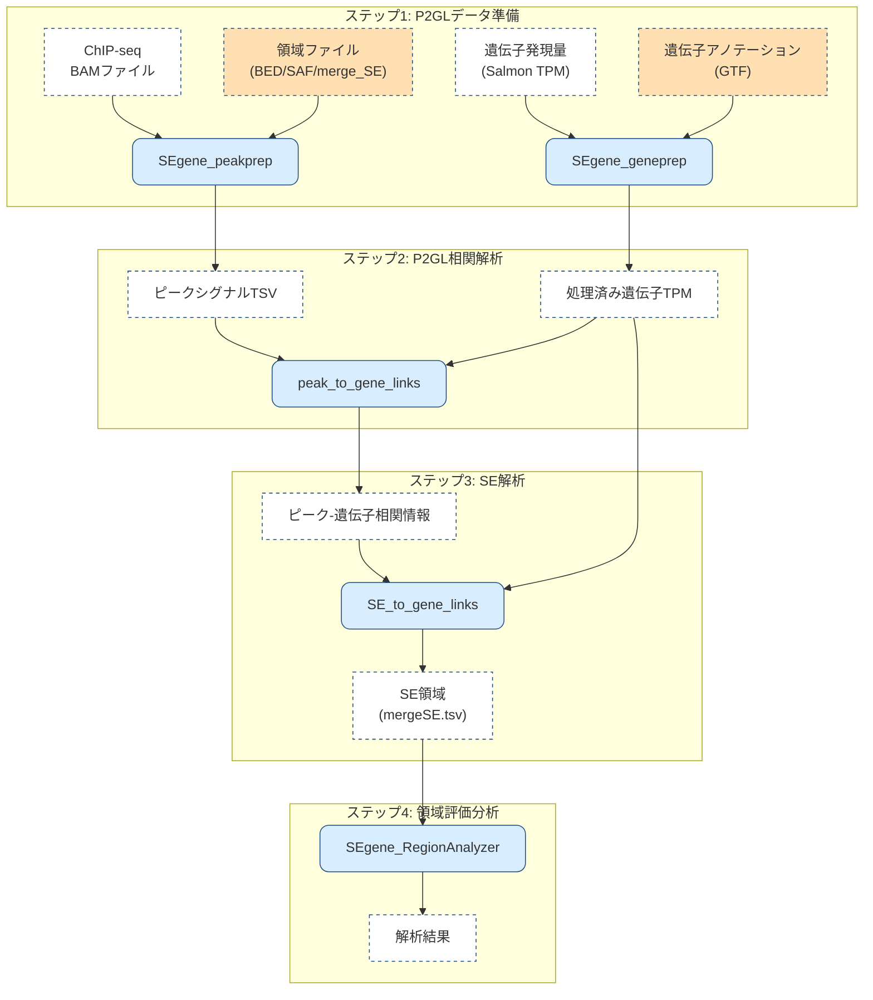

# SEgene

*(For the English version of this README, please see [README.md](https://github.com/hamamoto-lab/SEgene/blob/main/README.md).)*

**SEgene** （「エスイージーン」と発音、英語では "S-E-gene"）は、遺伝子とピーク領域間の相関を明らかにする統計手法であるpeak-to-gene linksアプローチを取り入れて、スーパーエンハンサーから遺伝子へのリンク (SE-to-gene links) を特定及び分析するためのプラットフォームです。
このリポジトリには **SEgene** 実行のためのツールとスクリプトが含まれています。

## 特徴

- スーパーエンハンサーと遺伝子の関連性を解析
- グラフ理論を用いたデータの可視化
- Jupyter Notebookでのインタラクティブな解析

## プログラム構成

SEgene は現在、四つの主要コンポーネント（P2GLデータ準備、P2GL相関解析、スーパーエンハンサー解析、領域評価分析）から構成されています。

### ワークフロー概要

SEgeneの処理の流れを以下の図に示します：

### P2GLデータ準備

- [**SEgene_peakprep**](https://github.com/hamamoto-lab/SEgene/blob/main/SEgene_peakprep/README_ja.md)  
  ChIP‑seq データ（BAM ファイル）から指定ゲノム領域のシグナルを定量化・正規化  
  （Standard log2‑CPM、edgeR 正規化 CPM、BigWig の 3 手法に対応）。  
  *edgeR 正規化 CPM の詳細は*  
  [`SEgene_peakprep/cpm_calcnorm_README_ja.md`](./SEgene_peakprep/cpm_calcnorm_README_ja.md) *を参照*  
- [**SEgene_geneprep**](https://github.com/hamamoto-lab/SEgene/tree/main/SEgene_geneprep/README_ja.md)  
  RNA‑seq データ（TPM‑TSV ファイル）を P2GL input 用に領域情報を付加

### P2GL相関解析

- [**peak_to_gene_links**](https://github.com/hamamoto-lab/SEgene/tree/main/peak_to_gene_links/README_ja.md) ChIP-seqデータと遺伝子発現データを統合し、エンハンサーピークと遺伝子発現間の相関情報を取得

### スーパーエンハンサー解析

- [**SE_to_gene_links**](https://github.com/hamamoto-lab/SEgene/tree/main/SE_to_gene_links/README_ja.md) P2GLによって得られた相関情報を用いてスーパーエンハンサーを評価・分析
- [**cli_tools**](https://github.com/hamamoto-lab/SEgene/blob/main/cli_tools/README_ja.md) （補助ツール）SE_to_gene_linksで同定されたSE領域と遺伝子発現の相関を解析

### 領域評価分析(オプション)

-  [**SEgene_RegionAnalyzer**](https://github.com/hamamoto-lab/SEgene/tree/main/SEgene_region_analyzer/README_ja.md) 同定されたSE領域の公共データベース情報による分析評価

## 使用方法

インストールおよび使用方法については、それぞれの `README` を参照してください。

- [SEgene_peakprep](https://github.com/hamamoto-lab/SEgene/blob/main/SEgene_peakprep/README_ja.md)
- [SEgene_geneprep](https://github.com/hamamoto-lab/SEgene/blob/main/SEgene_geneprep/README_ja.md)
- [peak_to_gene_links](https://github.com/hamamoto-lab/SEgene/blob/main/peak_to_gene_links/README_ja.md)
- [SE_to_gene_links](https://github.com/hamamoto-lab/SEgene/blob/main/SE_to_gene_links/README_ja.md)
- [SEgene_RegionAnalyzer](https://github.com/hamamoto-lab/SEgene/blob/main/SEgene_region_analyzer/README_ja.md)

## 変更履歴

本プロジェクトは [Semantic Versioning](https://semver.org/spec/v2.0.0.html) に準拠し、主な更新内容は以下のファイルに記載しています。

- [CHANGELOG.md (英語)](https://github.com/hamamoto-lab/SEgene/blob/main/CHANGELOG.md)
- [CHANGELOG_ja.md (日本語)](https://github.com/hamamoto-lab/SEgene/blob/main/CHANGELOG_ja.md)

それぞれのバージョンで追加された機能・修正点などの詳細を知りたい場合は、上記のファイルを参照してください。

## CITATION

このツールを研究に使用する場合は、以下のCITATIONファイルを参照してください：
[CITATION](https://github.com/hamamoto-lab/SEgene/blob/main/CITATION)
**(論文は現在準備中です。)**

## ライブラリとライセンス

このプロジェクトでは様々なオープンソースライブラリを用いています。以下は使用されているライブラリとそれぞれのライセンスの一覧です：

### Python

- **バージョン**: Python 3.10
- **ライブラリ**:
    - [**Biopython**](https://biopython.org/) - Biopython License Agreement
    - [**Pandas**](https://pandas.pydata.org/) - BSD License
    - [**Matplotlib**](https://matplotlib.org/) - PSF and BSD License
    - [**Seaborn**](https://seaborn.pydata.org/) - BSD License
    - [**Scipy**](https://scipy.org/) - BSD License
    - [**Statsmodels**](https://www.statsmodels.org/) - BSD License
    - [**PyBedTools**](https://daler.github.io/pybedtools/) - MIT License
    - [**PyRanges**](https://github.com/biocore-ntnu/pyranges) - MIT License
    - [**PyGenomeViz**](https://github.com/moshi4/pygenomeviz) - MIT License
    - [**Jupyter**](https://jupyter.org/) - BSD License
    - [**IPython**](https://ipython.org/) - BSD License
    - [**NetworkX**](https://networkx.org/) - BSD License
    - [**Pillow**](https://python-pillow.org/) - HPND License
    - [**NumPy**](https://numpy.org/) - BSD License
    - [**PySide6**](https://doc.qt.io/qtforpython/) - LGPL License
    - [**HDF5**](https://www.hdfgroup.org/solutions/hdf5/) - BSD License
    - [**requests**](https://requests.readthedocs.io/) - Apache 2.0 License
    - [**urllib3**](https://urllib3.readthedocs.io/) - MIT License
    - [**japanize-matplotlib**](https://github.com/uehara1414/japanize-matplotlib) - MIT License
    - [**Tornado**](https://www.tornadoweb.org/en/stable/) - Apache 2.0 License
    - [**Traitlets**](https://traitlets.readthedocs.io/) - BSD License
    - [**Pygments**](https://pygments.org/) - BSD License
    - [**bleach**](https://github.com/mozilla/bleach) - Apache 2.0 License
    - [**BeautifulSoup4**](https://www.crummy.com/software/BeautifulSoup/) - MIT License
    - [**Jedi**](https://github.com/davidhalter/jedi) - MIT License
    - [**Prometheus-client**](https://github.com/prometheus/client_python) - Apache 2.0 License
    - [**DefusedXML**](https://github.com/tiran/defusedxml) - PSF License
    - [**pytz**](https://pytz.sourceforge.net/) - MIT License
    - [**pyyaml**](https://pyyaml.org/) - MIT License
    - [**six**](https://github.com/benjaminp/six) - MIT License
    - [**MarkupSafe**](https://palletsprojects.com/p/markupsafe/) - BSD License
    - [**Certifi**](https://certifi.io/) - Mozilla Public License 2.0
    - [**idna**](https://github.com/kjd/idna) - MIT License
    - [**argon2-cffi**](https://argon2-cffi.readthedocs.io/) - MIT License
    - [**zipp**](https://github.com/jaraco/zipp) - MIT License

### R

- **バージョン**: R 4.2.2
- **ライブラリ**:
    - [**BiocManager**](https://cran.r-project.org/web/packages/BiocManager/index.html) - GPL License
    - [**data.table**](https://cran.r-project.org/web/packages/data.table/index.html) - MPL-2.0 License
    - [**openxlsx**](https://cran.r-project.org/web/packages/openxlsx/index.html) - MIT License
    - [**optparse**](https://cran.r-project.org/web/packages/optparse/index.html) - GPL License
    - [**pbmcapply**](https://cran.r-project.org/web/packages/pbmcapply/index.html) - MIT License
    - [**stringr**](https://cran.r-project.org/web/packages/stringr/index.html) - MIT License
    - [**GenomicRanges**](https://bioconductor.org/packages/release/bioc/html/GenomicRanges.html) - GPL License
    - [**rhdf5**](https://bioconductor.org/packages/release/bioc/html/rhdf5.html) - Artistic License 2.0
    - [**edgeR**](https://bioconductor.org/packages/release/bioc/html/edgeR.html) - GPL License

### Python-R連携

- [**rpy2**](https://rpy2.github.io/) - GNU GPL v2+ License
  Python内からRを呼び出すためのインターフェース。edgeR正規化CPM機能で使用。

### Julia

- **バージョン**: Julia 1.8.3
- **ライブラリ**:
    - [**ArgParse**](https://github.com/carlobaldassi/ArgParse.jl) - MIT License
    - [**HDF5**](https://github.com/JuliaIO/HDF5.jl) - MIT License
    - [**RData**](https://github.com/JuliaData/RData.jl) - MIT License
    - [**StatsBase**](https://github.com/JuliaStats/StatsBase.jl) - MIT License

### Genomics Tools

- [**Bedtools**](https://bedtools.readthedocs.io/) - MIT License
  Bedtools はgenome領域に関する解析に使用され、Python ラッパーライブラリ PyBedTools を通じてアクセスされます。
- [**samtools**](http://www.htslib.org/) - MIT License
  samtools はBAMファイルの解析と統計情報の取得に使用されます。
- [**featureCounts**](http://subread.sourceforge.net/) - GPL License
  featureCounts は定義されたゲノム領域におけるリードのカウントに使用されます。
- [**deeptools**](https://deeptools.readthedocs.io/) - BSD License
  deeptools はBigWig方式におけるBAMからbigWigへの変換およびシグナル抽出に使用されます。

SE_to_gene_links の依存関係の全リストについては、[SE_to_gene_links/environment.yml](https://github.com/hamamoto-lab/SEgene/blob/main/SE_to_gene_links/environment.yml) を参照してください。

## ベースイメージと依存関係管理

このプロジェクトでは**SE_to_gene_links**の依存関係管理に Miniforge3 を使用しています。Miniforge3 は Conda Forge のためのミニマルインストーラーで、Conda 用のコミュニティ主導のパッケージコレクションを提供します。

### 使用環境(SE_to_gene_links)

- **Docker**: このプロジェクトではベースとして `condaforge/miniforge3` Docker イメージを使用しています。
  - **ベースイメージ**: [condaforge/miniforge3](https://hub.docker.com/r/condaforge/miniforge3)
    - BSD 3-Clause License の下でライセンスされています。
- **スタンドアロンインストール**: Miniforge3 はローカルシステムに直接インストールすることもできます。
  - インストール手順は [Miniforge GitHub ページ](https://github.com/conda-forge/miniforge) を参照してください。

### パッケージソース

- **[Conda Forge](https://conda-forge.org/)**  
  - Conda Forge は幅広いプラットフォームサポートを持つ、コミュニティ管理のパッケージコレクションを提供します。
  - BSD 3-Clause License の下でライセンスされています。

## ライセンス

このプログラムはMITライセンスで公開されています。詳細については、[LICENSE](https://github.com/hamamoto-lab/SEgene/blob/main/LICENSE)をご覧ください。