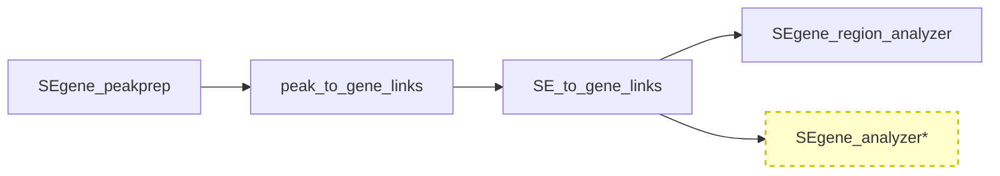

# SEgene_analyzer (Development Version)

*(For the Japanese version of this README, please see [README_ja.md](README_ja.md).)*

**SEgene_analyzer** is a **development version** of the SEgene Region Analyzer component, designed for analyzing super-enhancer regions using SEdb data with enhanced command-line interface and modern Python packaging.

> **⚠️ Development Status**: This is an **experimental development version** of the region analyzer. For stable usage requirements, please also consider using [SEgene_region_analyzer](https://github.com/hamamoto-lab/SEgene/tree/main/SEgene_region_analyzer).

## Project Context

SEgene_analyzer is part of the **SEgene project** workflow, specifically extending **Step 4: Region Evaluation** with enhanced functionality:



*\*Development version with enhanced CLI and modern packaging*

### Related Components

- **Parent Project**: [SEgene](https://github.com/hamamoto-lab/SEgene) - Complete super-enhancer analysis platform
- **Stable Version**: [SEgene_region_analyzer](https://github.com/hamamoto-lab/SEgene/tree/main/SEgene_region_analyzer) - Production-ready region analyzer
- **Upstream**: [SE_to_gene_links](https://github.com/hamamoto-lab/SEgene/tree/main/SE_to_gene_links) - Provides input data for region analysis

## Key Improvements over Stable Version

### Enhanced CLI Interface
- **4 specialized commands**: `prepare-stats`, `batch`, `single`, `report`
- **Comprehensive help system**: Built-in documentation and examples
- **Flexible input formats**: Both TSV and BED file support
- **Advanced caching**: Pre-calculated statistics for faster analysis

### Modern Python Packaging
- **pip-installable**: Standard `pip install -e .` installation
- **Entry point**: `sedb-analyzer` command available system-wide
- **Dependency management**: Proper `requirements.txt` integration
- **Test suite**: Comprehensive unit tests included

### Developer-Friendly Features
- **Bilingual documentation**: Japanese and English guides
- **Comprehensive examples**: Real-world usage scenarios
- **Test coverage**: 29 test cases covering core functionality
- **Type hints**: Enhanced code clarity and IDE support

## Features

### Core Analysis Capabilities
- **Batch Processing**: Analyze multiple genomic regions from TSV/BED files
- **Single Region Analysis**: Detailed analysis of specific genomic regions
- **Tissue Enrichment Analysis**: Statistical evaluation of tissue-specific SE enrichment
- **Peak Detection**: Advanced peak detection in super-enhancer regions
- **Database Integration**: SEdb 2.0 integration with caching support

### Output Options
- **Multiple formats**: PNG, SVG, PDF, EPS figure formats
- **Comprehensive reports**: HTML reports with detailed analysis results
- **Data export**: TSV, CSV, and Parquet format support
- **Flexible organization**: Hierarchical output directory structure

### Performance Features
- **Statistics caching**: Aims to improve batch processing speed through pre-calculation
- **Parallel processing**: Multi-core support designed for large datasets
- **Memory efficiency**: Optimized data structures and processing pipelines
- **Configurable thresholds**: Customizable analysis parameters

> **Performance Note**: Actual performance may vary depending on system specifications, data size, and configuration.

## Installation

### Prerequisites

- **Python**: 3.11+
- **System Tools**: bedtools (for pybedtools integration)
- **Memory**: 8GB+ recommended for large datasets
- **Storage**: 10GB+ free space for analysis results

> **System Note**: Requirements may vary depending on data size and analysis complexity. These are general recommendations.

### Installation Steps

1. **Clone the repository**:
   ```bash
   git clone https://github.com/hamamoto-lab/SEgene.git
   cd SEgene/SEgene_analyzer
   ```

2. **Install dependencies**:
   ```bash
   pip install -r requirements.txt
   ```

3. **Install in development mode**:
   ```bash
   pip install -e .
   ```

4. **Verify installation**:
   ```bash
   sedb-analyzer --help
   ```

### Data Setup

Download required SEdb 2.0 data files:

> **Note**: This tool depends on external SEdb 2.0 database service. Data availability is subject to the external service provider's policies and may change without notice.

1. **Visit**: [SEdb 2.0 Download](http://www.licpathway.net/sedb/download.php)
2. **Download**:
   - `human_sample_information_sedb2.txt` (Sample metadata)
   - `SE_package_hg38.bed` (Super-enhancer definitions)
3. **Place in data directory** (recommended structure):
   ```
   project_root/
   ├── SEgene_analyzer/
   └── data/SEdb/
       ├── human_sample_information_sedb2.txt
       └── SE_package_hg38.bed
   ```

## Quick Start

### 1. Pre-calculate Statistics (Recommended)
```bash
sedb-analyzer prepare-stats \
  -b data/SEdb/SE_package_hg38.bed \
  -s data/SEdb/human_sample_information_sedb2.txt \
  -o cache/sedb_stats.pkl
```

### 2. Batch Analysis
```bash
sedb-analyzer batch \
  -b data/SEdb/SE_package_hg38.bed \
  -s data/SEdb/human_sample_information_sedb2.txt \
  -r regions.tsv \
  -o results/ \
  --use-cached-stats cache/sedb_stats.pkl
```

### 3. Single Region Analysis
```bash
sedb-analyzer single \
  -b data/SEdb/SE_package_hg38.bed \
  -s data/SEdb/human_sample_information_sedb2.txt \
  --chr chr7 --start 1000000 --end 2000000 \
  -o results/
```

### 4. Generate Database Report
```bash
sedb-analyzer report \
  -b data/SEdb/SE_package_hg38.bed \
  -s data/SEdb/human_sample_information_sedb2.txt \
  -o report/
```

## Documentation

### User Guides
- **[Usage Guide](docs/usage.md)** - Complete usage instructions
- **[Usage Guide](docs/usage_ja.md)** (Japanese) - Comprehensive command reference
- **[Installation Guide](docs/segene_analyzer_installation.md)** - Detailed setup instructions
- **[Installation Guide](docs/segene_analyzer_installation_ja.md)** (Japanese) - Detailed setup instructions

### Examples
- **[Examples](examples/README.md)** - Real-world workflows
- **[Examples](examples/README_ja.md)** (Japanese) - Practical usage scenarios

### Development
- **[Test Suite](tests/)** - Unit tests and test runners

## Comparison with Stable Version

| Feature | SEgene_analyzer (Dev) | SEgene_region_analyzer (Stable) |
|---------|----------------------|----------------------------------|
| **CLI Interface** | ✅ Modern `sedb-analyzer` command | ⚠️ Script-based `run_batch_processor.py` |
| **Installation** | ✅ `pip install -e .` | ❌ Manual setup required |
| **Caching** | ✅ Advanced statistics caching | ❌ No caching support |
| **Documentation** | ✅ Bilingual comprehensive docs | ⚠️ Basic documentation |
| **Testing** | ✅ 29 test cases | ❌ No test suite |
| **Input Formats** | ✅ TSV + BED support | ⚠️ TSV + BED (limited) |
| **Output Formats** | ✅ Multiple formats (PNG/SVG/PDF/EPS) | ⚠️ Limited formats |
| **Performance** | ✅ Optimized with caching | ⚠️ No optimization |
| **Stability** | ⚠️ Development version | ✅ Production ready |

## Development Status

### Current Version Features
- ✅ **Core functionality**: All basic analysis features implemented
- ✅ **CLI interface**: Complete command-line interface with 4 subcommands
- ✅ **Documentation**: Comprehensive bilingual documentation
- ✅ **Testing**: Basic test suite with 29 test cases
- ✅ **Examples**: Real-world usage scenarios

### Future Updates
- 🔄 **Feature enhancements and performance improvements are planned**

### Migration Path
For users of the stable version, migration involves:
1. **Installation**: `pip install -e .` instead of manual setup
2. **Command structure**: `sedb-analyzer batch` instead of `python run_batch_processor.py`
3. **Enhanced features**: Utilize caching and advanced options
4. **Documentation**: Refer to new comprehensive guides

## Testing

### Run Tests
```bash
# Run all tests
python tests/run_tests.py

# Run specific test module
python tests/run_tests.py basic_functionality

# Run with pytest (if available)
pytest tests/
```

### Test Coverage
- **CLI functionality**: Argument parsing, command validation
- **Core logic**: Region overlap, coordinate validation, statistics
- **File operations**: Input/output handling, format detection
- **Error handling**: Exception management, validation

## System Requirements

### Minimum Requirements
- **Python**: 3.11+
- **Memory**: 4GB RAM
- **Storage**: 5GB free space
- **OS**: Linux, macOS, Windows (WSL2 recommended)

### Recommended Configuration
- **Python**: 3.11+
- **Memory**: 16GB+ RAM for large datasets
- **Storage**: 50GB+ for extensive analysis
- **CPU**: Multi-core processor for parallel processing

## License

This program is released under the MIT License. For more details, please refer to the [LICENSE](https://github.com/hamamoto-lab/SEgene/blob/main/LICENSE) file.

## Citation

If you use this tool in your research, please cite:

Shinkai, N., Asada, K., Machino, H., Takasawa, K., Takahashi, S., Kouno, N., Komatsu, M., Hamamoto, R., & Kaneko, S. (2025). SEgene identifies links between super enhancers and gene expression across cell types. *npj Systems Biology and Applications*, 11(1), 49. https://doi.org/10.1038/s41540-025-00533-x

For detailed citation information and additional references, please refer to the [CITATION](https://github.com/hamamoto-lab/SEgene/blob/main/CITATION) file.

## Acknowledgments

This development version builds upon the foundation of the original SEgene_region_analyzer and incorporates feedback from SEgene users. Special thanks to all contributors and users who have helped shape this enhanced version.