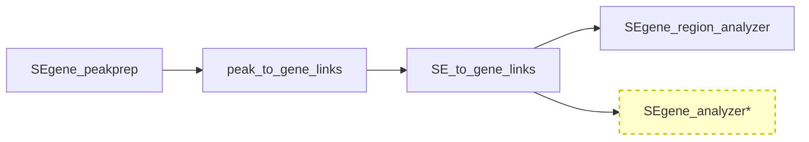

# SEgene_analyzer (開発版)

*(For the English version of this README, please see [README.md](README.md).)*

**SEgene_analyzer** は、SEdb データを使用したスーパーエンハンサー領域解析のための **開発版** コンポーネントです。強化されたコマンドラインインターフェースと現代的な Python パッケージング機能を備えています。

> **⚠️ 開発状況**: これは領域解析ツールの **実験的開発版** です。安定利用を求める場合は [SEgene_region_analyzer](https://github.com/hamamoto-lab/SEgene/tree/main/SEgene_region_analyzer) の使用も検討してください。

## プロジェクトでの位置づけ

SEgene_analyzer は **SEgene プロジェクト** ワークフローの一部であり、特に **ステップ4: 領域評価** を強化した機能を提供します：



*\*強化されたCLIとモダンパッケージングを持つ開発版*

### 関連コンポーネント

- **親プロジェクト**: [SEgene](https://github.com/hamamoto-lab/SEgene) - 完全なスーパーエンハンサー解析プラットフォーム
- **安定版**: [SEgene_region_analyzer](https://github.com/hamamoto-lab/SEgene/tree/main/SEgene_region_analyzer) - 本番対応の領域解析ツール
- **上流**: [SE_to_gene_links](https://github.com/hamamoto-lab/SEgene/tree/main/SE_to_gene_links) - 領域解析用の入力データを提供

## 安定版からの主な改善点

### 強化されたCLIインターフェース
- **4つの専用コマンド**: `prepare-stats`, `batch`, `single`, `report`
- **包括的なヘルプシステム**: 組み込みドキュメントと使用例
- **柔軟な入力フォーマット**: TSV と BED ファイルの両方をサポート
- **高度なキャッシュ機能**: 事前計算された統計情報による高速解析

### 現代的な Python パッケージング
- **pip インストール対応**: 標準的な `pip install -e .` インストール
- **エントリーポイント**: `sedb-analyzer` コマンドがシステム全体で利用可能
- **依存関係管理**: 適切な `requirements.txt` 連携
- **テストスイート**: 包括的な単体テストを含む

### 開発者向け機能
- **二言語対応ドキュメント**: 日本語と英語のガイド
- **包括的な使用例**: 実際のユースケースシナリオ
- **テストカバレッジ**: 中核機能をカバーする 29 のテストケース
- **型ヒント**: コードの明確性と IDE サポートの向上

## 機能

### 中核解析機能
- **バッチ処理**: TSV/BED ファイルから複数のゲノム領域を解析
- **単一領域解析**: 特定のゲノム領域の詳細解析
- **組織エンリッチメント解析**: 組織特異的 SE エンリッチメントの統計的評価
- **ピーク検出**: スーパーエンハンサー領域での高度なピーク検出
- **データベース統合**: キャッシュサポート付き SEdb 2.0 統合

### 出力オプション
- **多様なフォーマット**: PNG, SVG, PDF, EPS 図形フォーマット
- **包括的レポート**: 詳細な解析結果を含む HTML レポート
- **データエクスポート**: TSV, CSV, Parquet フォーマット対応
- **柔軟な構成**: 階層的な出力ディレクトリ構造

### パフォーマンス機能
- **統計キャッシュ**: 事前計算によるバッチ処理速度向上を目指します
- **並列処理**: 大規模データセット用のマルチコア対応設計
- **メモリ効率**: 最適化されたデータ構造と処理パイプライン
- **設定可能な閾値**: カスタマイズ可能な解析パラメータ

> **パフォーマンス注意**: 実際のパフォーマンスは、システム仕様、データサイズ、設定により異なります。

## インストール

### 前提条件

- **Python**: 3.11+
- **システムツール**: bedtools (pybedtools 統合用)
- **メモリ**: 大規模データセットには 8GB+ 推奨
- **ストレージ**: 解析結果用に 10GB+ の空き容量

> **システム注意**: 要件はデータサイズや解析の複雑さによって異なります。これらは一般的な推奨事項です。

### インストール手順

1. **リポジトリをクローン**:
   ```bash
   git clone https://github.com/hamamoto-lab/SEgene.git
   cd SEgene/SEgene_analyzer
   ```

2. **依存関係をインストール**:
   ```bash
   pip install -r requirements.txt
   ```

3. **開発モードでインストール**:
   ```bash
   pip install -e .
   ```

4. **インストール確認**:
   ```bash
   sedb-analyzer --help
   ```

### データセットアップ

必要な SEdb 2.0 データファイルをダウンロード:

> **注意**: 本ツールは外部のSEdb 2.0データベースサービスに依存しています。データの可用性は外部サービス提供者の方針に従い、予告なく変更される場合があります。

1. **アクセス**: [SEdb 2.0 Download](http://www.licpathway.net/sedb/download.php)
2. **ダウンロード**:
   - `human_sample_information_sedb2.txt` (サンプルメタデータ)
   - `SE_package_hg38.bed` (スーパーエンハンサー定義)
3. **データディレクトリに配置** (推奨構造):
   ```
   project_root/
   ├── SEgene_analyzer/
   └── data/SEdb/
       ├── human_sample_information_sedb2.txt
       └── SE_package_hg38.bed
   ```

## クイックスタート

### 1. 統計情報の事前計算 (推奨)
```bash
sedb-analyzer prepare-stats \
  -b data/SEdb/SE_package_hg38.bed \
  -s data/SEdb/human_sample_information_sedb2.txt \
  -o cache/sedb_stats.pkl
```

### 2. バッチ解析
```bash
sedb-analyzer batch \
  -b data/SEdb/SE_package_hg38.bed \
  -s data/SEdb/human_sample_information_sedb2.txt \
  -r regions.tsv \
  -o results/ \
  --use-cached-stats cache/sedb_stats.pkl
```

### 3. 単一領域解析
```bash
sedb-analyzer single \
  -b data/SEdb/SE_package_hg38.bed \
  -s data/SEdb/human_sample_information_sedb2.txt \
  --chr chr7 --start 1000000 --end 2000000 \
  -o results/
```

### 4. データベースレポート生成
```bash
sedb-analyzer report \
  -b data/SEdb/SE_package_hg38.bed \
  -s data/SEdb/human_sample_information_sedb2.txt \
  -o report/
```

## ドキュメント

### ユーザーガイド
- **[使用方法ガイド](docs/usage_ja.md)** - 包括的なコマンドリファレンス
- **[Usage Guide](docs/usage.md)** (English) - 完全な使用説明書
- **[インストールガイド](docs/segene_analyzer_installation_ja.md)** - 詳細なセットアップ手順
- **[Installation Guide](docs/segene_analyzer_installation.md)** (English) - Detailed setup instructions

### 使用例
- **[使用例](examples/README_ja.md)** - 実用的な使用シナリオ
- **[Examples](examples/README.md)** (English) - 実世界のワークフロー

### 開発者向け
- **[テストスイート](tests/)** - 単体テストとテストランナー

## 安定版との比較

| 機能 | SEgene_analyzer (開発版) | SEgene_region_analyzer (安定版) |
|------|--------------------------|-----------------------------------|
| **CLI インターフェース** | ✅ モダンな `sedb-analyzer` コマンド | ⚠️ スクリプトベース `run_batch_processor.py` |
| **インストール** | ✅ `pip install -e .` | ❌ 手動セットアップが必要 |
| **キャッシュ** | ✅ 高度な統計キャッシュ | ❌ キャッシュサポートなし |
| **ドキュメント** | ✅ 二言語対応包括的ドキュメント | ⚠️ 基本的なドキュメント |
| **テスト** | ✅ 29 テストケース | ❌ テストスイートなし |
| **入力フォーマット** | ✅ TSV + BED サポート | ⚠️ TSV + BED (制限あり) |
| **出力フォーマット** | ✅ 多様なフォーマット (PNG/SVG/PDF/EPS) | ⚠️ 制限されたフォーマット |
| **パフォーマンス** | ✅ キャッシュによる最適化 | ⚠️ 最適化なし |
| **安定性** | ⚠️ 開発版 | ✅ 本番対応 |

## 開発状況

### 現在のバージョン機能
- ✅ **中核機能**: 全ての基本解析機能を実装
- ✅ **CLI インターフェース**: 4つのサブコマンドを持つ完全なコマンドライン
- ✅ **ドキュメント**: 包括的な二言語対応ドキュメント
- ✅ **テスト**: 29 テストケースを含む基本テストスイート
- ✅ **使用例**: 実世界のユースケースシナリオ

### 今後のアップデート
- 🔄 **機能強化とパフォーマンス改善を予定しています**

### 移行パス
安定版のユーザーの場合、移行には以下が含まれます：
1. **インストール**: 手動セットアップの代わりに `pip install -e .`
2. **コマンド構造**: `python run_batch_processor.py` の代わりに `sedb-analyzer batch`
3. **強化機能**: キャッシュと高度オプションの活用
4. **ドキュメント**: 新しい包括的ガイドを参照

## テスト

### テスト実行
```bash
# 全テスト実行
python tests/run_tests.py

# 特定のテストモジュール実行
python tests/run_tests.py basic_functionality

# pytest での実行 (利用可能な場合)
pytest tests/
```

### テストカバレッジ
- **CLI 機能**: 引数パース、コマンド検証
- **中核ロジック**: 領域重複、座標検証、統計
- **ファイル操作**: 入出力処理、フォーマット検出
- **エラーハンドリング**: 例外管理、検証

## システム要件

### 最小要件
- **Python**: 3.11+
- **メモリ**: 4GB RAM
- **ストレージ**: 5GB 空き容量
- **OS**: Linux, macOS, Windows (WSL2 推奨)

### 推奨構成
- **Python**: 3.11+
- **メモリ**: 大規模データセット用に 16GB+ RAM
- **ストレージ**: 広範囲な解析用に 50GB+
- **CPU**: 並列処理用マルチコアプロセッサ

## ライセンス

このプログラムは MIT ライセンスで公開されています。詳細については、[LICENSE](https://github.com/hamamoto-lab/SEgene/blob/main/LICENSE) ファイルを参照してください。

## 引用

このツールを研究に使用する場合は、以下を引用してください：

Shinkai, N., Asada, K., Machino, H., Takasawa, K., Takahashi, S., Kouno, N., Komatsu, M., Hamamoto, R., & Kaneko, S. (2025). SEgene identifies links between super enhancers and gene expression across cell types. *npj Systems Biology and Applications*, 11(1), 49. https://doi.org/10.1038/s41540-025-00533-x

詳細な引用情報と追加の参考文献については、[CITATION](https://github.com/hamamoto-lab/SEgene/blob/main/CITATION) ファイルを参照してください。

## 謝辞

この開発版は、元の SEgene_region_analyzer の基盤の上に構築され、SEgene ユーザーからのフィードバックを取り入れています。この強化版の形成に貢献したすべての貢献者とユーザーに特別な感謝を申し上げます。